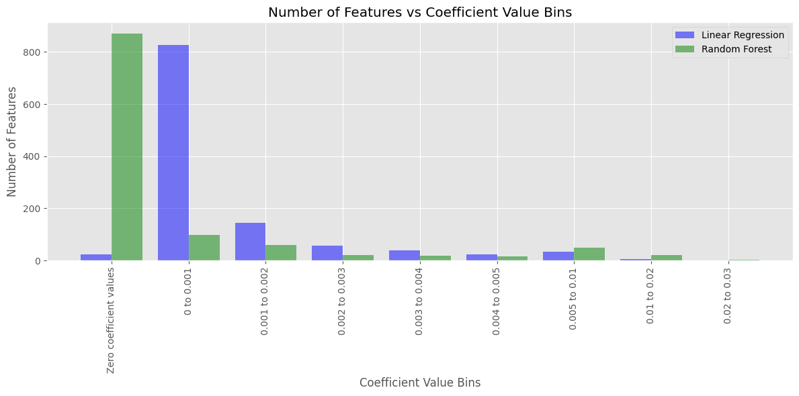
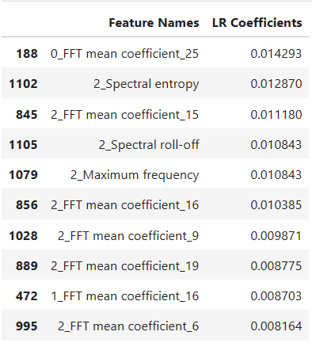

## Compare DT, RF and Linear regression.
 For linear regression: each class label as an integer value. Say, 1: Sitting, 2:..., and so on. Use features extracted (from flattened out Linear Acceleration) using the TSFEL library. Compare the performance of these models. Is the usage of linear regression for classification justified? Why or why not? 

### Answer:
#### The performance of Decision Tree (DT), Random Forest (RF), and Linear Regression (LR) models was compared using features extracted from the UCI-HAR dataset. The features were extracted using the TSFEL library from the flattened out linear acceleration data.
#### Here are the accuracies obtained for each model:

####   Decision Tree: 88.89%
####   Random Forest: 97.22%
####   Linear Regression: 63.89%
#### The confusion matrices and feature importance analysis were also performed for each model.

#### Confusion matrix of Decision tree

#### Confusion matrix of Random forest

#### Confusion matrix of linear Regression

### Comparing the performance:
1. Decision Tree and Random Forest achieved higher accuracies compared to Linear Regression. This suggests that decision tree-based models (DT and RF) are more suitable for this classification task, as they can capture non-linear relationships between features and labels more effectively.
2. Random Forest achieves higher accuracy compared to Decision Trees due to its ensemble learning approach, which combines multiple decision trees to mitigate overfitting and improve generalization performance. By introducing randomness, considering random subsets of features at each split, and aggregating predictions, Random Forest can capture complex, non-linear relationships more effectively, making it robust to noise and outliers. This results in superior performance in classification tasks, where accuracy is paramount.

3. Linear Regression assumes a linear relationship between features and labels, which may not hold true for complex classification problems like activity recognition from sensor data. Additionally, the integer label representation used in linear regression does not capture the ordinality or meaningful differences between activity classes effectively.

#### The usage of linear regression for classification is not justified as the accuracy for linear regression is lesser. The probable reasons for the lesser accuracy is given below:
1. Linear Regression assumes a linear relationship between the input features and the target variable. However, in classification tasks like activity recognition from sensor data, the relationship between the features and the activities is often non-linear. Linear Regression may struggle to capture these complex relationships adequately. For example, imagine plotting walking and standing on a graph based on sensor data. Linear Regression would draw a straight line between them, assuming that as the sensor data changes, the activity changes in a predictable, straight-line way. But in reality, there might be other factors that affect how the sensor data looks for each activity, making the relationship more complicated.
2. Linear Regression treats the target variable, in this case, the activity labels, as continuous variables. It predicts a numeric value for each activity label, which may not accurately capture the relationships between the activities. In other words, Linear Regression does not understand that certain activities are more similar to each other than others.For example, if we represent sitting, standing, and walking as 1, 2, and 3 respectively in Linear Regression. It treats each activity label as equally spaced apart, which may not reflect the true differences between the activities.

### Obtain the weights (take absolute values as weights can also be negative) of the linear regression model. Also, obtain the feature importance from the Random Forest model. Plot the weights obtained as a Bar plot. This will help you visualize what features are being prioritized by the models. Note that sum of feature importances for a Random Forest model is 1. you will have to bring the linear regression weights to the same scale. To do so you can divide the weights by the sum of all the weights. Plot the importance of the features in the same plot. Figure out the top 10 important features obtained from both the models and display their names. What do you infer? 

### Linear Regression

 

#### Random forest

### Plotting both in the same plot

#### Top 10 obtained features from Linear Regression

#### Top 10 obtained features from Random Forest

### Obesrvations:

- Linear Regression isn't ideal for figuring out different activities from sensor data because it assumes that the relationship  between the data features and the activities is simple and straight. But in real life, things are usually more complicated than that. Plus, Linear Regression gives us numbers as outputs, but for activities like recognizing what someone's doing, we need specific categories, not just numbers.

- On the other hand, in models like Random Forest, we look at features like how much the movements change or how much energy they have. These features show us details in the data that aren't just simple and straight. For example, just looking at how much movements vary might not always tell us exactly what activity someone is doing because the connection between these features and activities is more complex.

- But then, some features look at the frequency of the signals, like "0_FFT mean coefficient_25." This means we're analyzing how often the movements happen and how they combine. While this could help us figure out the activity, different people might have different patterns for the same activity. And these patterns can vary a lot between people, making it hard for Linear Regression to understand them well.

- So, if we only have features like average and variance, Linear Regression might not work well, and we'd be better off using classifiers like Decision Trees (DT) and Random Forest (RF). But if we're only looking at features that show us the frequency of the activity, DT and RF might not work well, and Linear Regression could be a better choice.