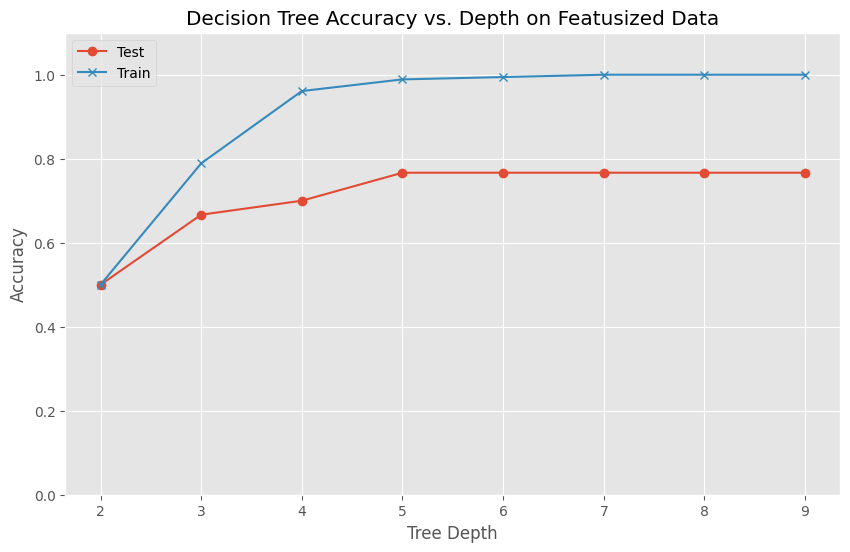
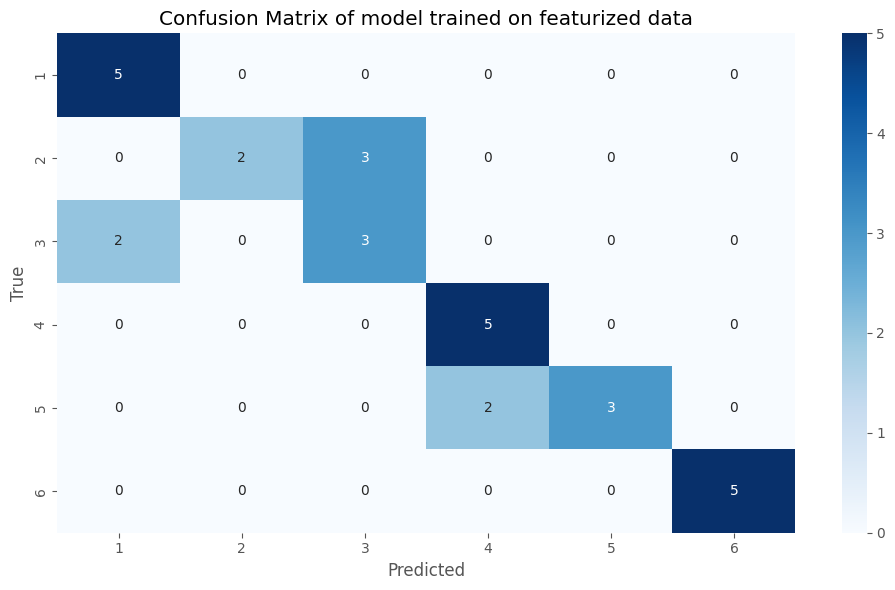

# HAR-Human-Activity-Recognizer-Decision-Tree-Model
This is a robust and efficient model for recognizing various human activities such as walking, walking upstairs, walking dowstairs, sitting, standing, and lying using accelerometer data. Human Activity Recognition (HAR) refers to the capability of machines to identify various activities performed by the users. The knowledge acquired from these recognition systems is integrated into many applications where the associated device uses it to identify actions or gestures and performs predefined tasks in response.

## Dataset
For this assignent we will be using a publically available dataset called [UCI-HAR](https://ieeexplore.ieee.org/stamp/stamp.jsp?tp=&arnumber=8567275). The dataset is available to download [here](https://archive.ics.uci.edu/dataset/240/human+activity+recognition+using+smartphones). The Dataset contains data for 30 participants . Each participant performed six activities while wearing a Samsung Galaxy S II smartphone on their waist (The video of the participants taking data is also available [here](http://www.youtube.com/watch?v=XOEN9W05_4A)). The smartphone's accelerometer and gyroscope captured 3-axial linear acceleration and 3-axial angular velocity. Read all the `readme` and `info` files for more information.

## Preprocessing.
We will use the raw accelerometer data within the inertial_signals folder. The provided script, `CombineScript.py`, organizes and sorts accelerometer data, establishing separate classes for each category and compiling participant data into these classes. `MakeDataset.py` script is used to read through all the participant data and create a single dataset. The dataset is then split into train,test and validation set. We focus on the first 10 seconds of activity, translating to the initial 500 data samples due to a sampling rate of 50Hz.

* **Step-1>** Place the `CombineScript.py` and `MakeDataset.py` in the same folder that contains the UCI dataset. Ensure you have moved into the folder before running the scripts. If you are runing the scripts from a different folder, you will have to play around with the paths in the scripts to make it work.
* **Step-2>** Run `CombineScript.py` and provide the paths to test and train folders in UCI dataset. This will create a folder called `Combined` which will contain all the data from all the participants. This is how most of the datasets are organized. You may encounter similar dataset structures in the future.
* **Step-3>** Run `MakeDataset.py` and provide the path to `Combined` folder. This will create a Dataset which will contain the train, test and validation set. You can use this dataset to train your models.

## Key Aspects for designing the model
The model is build upon the following key aspects and observation in the dataset:

1. Plot the waveform for data from each activity class. Are you able to see any difference/similarities between the activities?  Do you think the model will be able to classify the activities based on the data? 

- There are noticeable differences in acceleration patterns across the six activities. Walking, walking upstairs, and walking downstairs show pronounced fluctuations, easily distinguishable from sitting, standing, and laying.

- Among the dynamic activities, fluctuation ranges vary: walking has minor fluctuations, while walking downstairs has significant ones. Statistics like variance or standard deviation can help differentiate these activities.

- Static activities are distinguishable by distinct acceleration patterns in the X, Y, and Z directions.

- These pattern differences can be effectively used by a decision tree model to classify the activities based on the data.

2. Do you think we need a machine learning model to differentiate between static activities (laying, sitting, standing) and dynamic activities(walking, walking_downstairs, walking_upstairs)? Look at the linear acceleration $(acc_x^2+acc_y^2+acc_z^2)$ for each activity and justify your answer. 

- If we observe the plots, dynamic activities exhibit high fluctuation rates in acceleration, while static activities show minimal fluctuations. This is evident in the total acceleration plots, where dynamic activities have significant variations over time, whereas static activities maintain almost constant acceleration.

- These distinct patterns can be used as features to train the model, allowing it to easily differentiate between static and dynamic activities. However, distinguishing between activities within the dynamic or static categories might still pose a challenge.

3. Train Decision Tree with varrying depths (2-8) using trainset and report accuracy and confusion matrix using Test set. Does the accuracy changes when the depth is increased? Plot the accuracies and reason why such a result has been obtained. 

- Model accuracy changes with tree depth in Decision Trees. A deeper tree fits more complex functions, improving training performance.

- Initially, increasing depth improves both training and testing accuracy. However, beyond a certain point, test accuracy stagnates around 0.75, while training accuracy reaches 1, indicating overfitting.

- Overfitting occurs when the model learns noise instead of patterns, leading to poor generalization despite high training accuracy. This is evident from the accuracy plot.

- Increasing depth reduces bias but increases variance. Optimal performance requires balancing tree depth to achieve the right trade-off between bias and variance. Thus, higher depth doesn't always mean higher accuracy.

## Use PCA to compress the acceleration timeseries
We use PCA [(Principal Component Analysis)](https://en.wikipedia.org/wiki/Principal_component_analysis) on Total Acceleration $(acc_x^2+acc_y^2+acc_z^2)$ and a flattened dataset into two features. We can visualize different class of activities using below scatter plot.
 

 
 
 

  

 > `NOTE`:The 1500-feature flattened matrix is derived from transforming a 3D time-series dataset of size 30x500x3 into a 2D matrix of size 30x1500. This transformation involves flattening the 500 timestamps of each of the 30 observations across the 3 directions (X, Y, and Z) into 1500 separate features.

## Use TSFEL library for feature extraction
We use [TSFEL](https://tsfel.readthedocs.io/en/latest/) ([a featurizer library](https://github.com/fraunhoferportugal/tsfel)) to create features (your choice which ones you feel are useful) and then perform PCA to obtain two features. We can visualize different class of activities using below scatter plot.

 

## Key Observations
1. `Better Clustering`: The scatter plot of PCA applied to the TSFEL-generated feature matrix shows distinct clusters for different classes, unlike the scatter plot of PCA on total acceleration, where classes are highly mixed.

2. `Class Distinction`: In the featurized data, different classes are easily distinguishable. In contrast, PCA on the 1500-feature matrix clearly distinguishes only two classes (classes 4 and 6), while PCA on total acceleration fails to distinguish any class.

3. `Decision Boundaries`: It is difficult to create decision boundaries on scatter plots of total acceleration and the 1500-feature matrix. However, the featurized data allows for clearer decision boundaries with higher accuracy.

## Reasoning
- Featurized Dataset: The featurized dataset captures statistical patterns such as variance and mean of acceleration, which are crucial for distinguishing activities. Dynamic activities like walking, walking upstairs, and walking downstairs show high variance, while static activities like standing, laying, and sitting show low variance. This statistical approach helps in better class separation.

- Total Acceleration: Using total acceleration as a feature loses important distinctions in the dataset, such as the different values of acceleration in X, Y, and Z directions, making it a poor feature for classification.

- 1500-Feature Matrix: Relying on raw acceleration values at specific timestamps can lead to incorrect decisions, as similar acceleration values can appear in different activities momentarily. The featurized approach, which considers overall statistical properties like mean and variance over time, provides a more reliable basis for classification.

## Model trained on TSFEL features Vs trained on Raw flatened dataset.
 

 
 
 

 

- Featurized data works better than raw flatened data, as confirmed by the line plot comparing test accuracies of models trained on both datasets.
- `Model Performance`: The model trained on featurized data outperforms the model trained on raw data.
- `Confusion Matrix Comparison`: The confusion matrix shows that the model using the featurized matrix predicts almost all activities correctly.
- `Reason for Better Performance`: The featurized dataset captures hidden statistical patterns using features like entropy, variance, autocorrelation, and absolute energy, leading to better class distinction.

### Are there any participants/ activitivies where the Model performace is bad? If Yes, Why?
Yes there are some activities where the model performance is bad.
Most of the confusion amoung the dynamic activities i.e. the model is not able to distinguish between dynamic activities very well.The reason for bad performance can be seen from the below waveforms of dynamic activities. We can observe that the magnitude of acceleration in all direction(X, Y, Z) are almost same or in the same range and all of them have some fluctuation which are also more or less same. Since all the activities are similar i.e. of walking and having such similar dataset it could be difficult for our models to accurately predict them with 100% accuracy. Still the featurized dataset that we created is able to do a good job in distinguish the dynamic activities with very less mismatches.

 

# Deployment!
Utilized apps like `Physics Toolbox Suite` from your smartphone to collect your data in .csv/.txt format. Ensure at least 15 seconds of data is collected, trimming edges to obtain 10 seconds of relevant data. Collect 3-5 samples per activity class and report accuracy using both featurized and raw data. You have to train on UCI dataset (You can use the entire dataset if you want) and test it on the data that you have collected and report the accuracy and confusion matrix. Test your model's performance on the collected data, explaining why it succeeded or failed. 

### **Things to take care of:**
* Ensure the phone is placed in the same position for all the activities.
* Ensure the phone is in the same alignment during the activity as changing the alignment will change the data collected and will affect the model's performance. 
* Ensure to have atleast 10s of data per file for training. As the data is collected at 50Hz, you will have 500 data samples.

> `Collected Data folder` contains all the csv's of data collected using `Physics Toolbox Suite` app. Use `downsample.py` file to downsample the data to get 50 Kz desired frequency.
## Results

 
 
 

 

## Conclusion
By examining models trained on the same dataset with different features, we observe significant variations in performance. This demonstrates that a model's performance is not solely dependent on the choice of the model but also heavily influenced by the quality and relevance of the data and features used during training. Different models trained on the same data but with varying features can exhibit substantial differences in their accuracy and effectiveness. This highlights the critical role of selecting appropriate features, as the right features can enhance the model's ability to capture underlying patterns, leading to improved performance and better generalization to new data. Conversely, poorly chosen features can result in suboptimal models, regardless of the model's complexity or sophistication. Therefore, ensuring the features used are relevant and informative is essential for achieving high-performing models.

